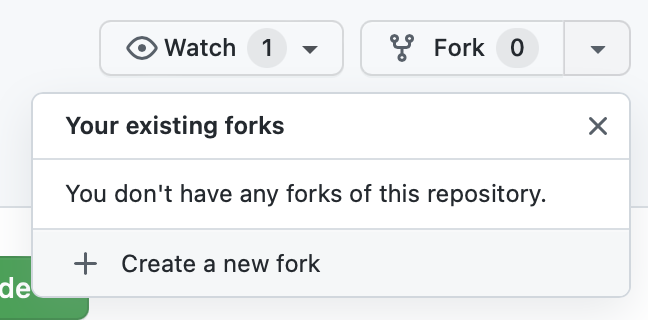
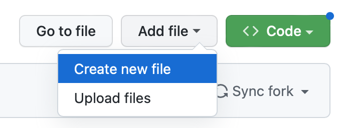

# ActionsDemo

The project was prepared as part of an [ElixirClub] talk **Creating Your First Elixir/Phoenix CI Check with GitHub Actions**.

[ElixirClub]: https://www.elixirclub.org

With a general overview of GitHub Actions complete, it is time to get some personal hands on experience.

## Exercise

This repo contains a basic Phoenix 1.7 application. Use the GitHub fork button and create a personal fork of the repo.



We'll add some GitHub Action workflows to your personal fork so you can see how GitHub Actions works first hand.

### Part 1

We'll be using the web-based file editor of GitHub to make these additions, but if you are more comfortable doing the file edits locally and pushing, feel free to that.

To get started our first workflow will be a simple `demo` so we can see some simple things working and understand how the website works.

From the front page of your personal repo fork, click on the `Add file ▾` button and then `Create new file`.



For the filename type `.github` then `/`, then `workflows`, then `/`, then `demo.yml`. This will make a new file `demo.yml` inside a specially named folder structure that GitHub looks for off the project root.

Inside the `demo.yml` file copy and past the following contents:

```yml
name: GitHub Actions Demo
run-name: ${{ github.actor }} is testing out GitHub Actions 🚀
on: [push]
jobs:
  Explore-GitHub-Actions:
    runs-on: ubuntu-latest
    steps:
      - run: echo "🎉 The job was automatically triggered by a ${{ github.event_name }} event."
      - run: echo "🐧 This job is now running on a ${{ runner.os }} server hosted by GitHub!"
      - run: echo "🔎 The name of your branch is ${{ github.ref }} and your repository is ${{ github.repository }}."
      - name: Check out repository code
        uses: actions/checkout@v3
      - run: echo "💡 The ${{ github.repository }} repository has been cloned to the runner."
      - run: echo "🖥️ The workflow is now ready to test your code on the runner."
      - name: List files in the repository
        run: |
          ls ${{ github.workspace }}
      - run: echo "🍏 This job's status is ${{ job.status }}."
```

Then at the bottom, choose `Create a new branch`. Name the branch something like `add-action-demo` and hit the `Commit new file` button. This should redirect you to the create PR form. Hit `Create pull request` twice on the next two pages to be taken to the Pull Request detail page.

At the bottom of the PR, click `Show all checks` to see the workflow check outcome. For more info, click `Details` which will take you to the workflow report.


The workflow report page will show you the outcome of all the jobs in the workflow. You can expand those steps to see more details, as well as access the log files of the workflow or even choose to manually re-run it.

### Part 2: An Elixir/Phoenix Run Test Workflow

Now let's look at the build and test workflow we saw during lecture.

Just like before, navigate to your personal fork's homepage and click the `Add file ▾` button.

For the filename type `.github`then `/`, then `workflows`, then `/`, then `elixir-test.yml`. This will make a new file `elixir-test.yml` inside a specially named folder structure off the project root.

Inside the `elixir-test.yml` file copy and past the following contents:

```yml
name: Elixir CI

# This file was derived from: https://fly.io/phoenix-files/github-actions-for-elixir-ci/

on:
  push:
    branches:
      - main
  pull_request:
    branches:
      - "*"

env:
  MIX_ENV: test

jobs:
  test:
    services:
      db:
        image: postgres:14
        ports: ['5432:5432']
        env:
          POSTGRES_PASSWORD: postgres
        options: >-
          --health-cmd pg_isready
          --health-interval 10s
          --health-timeout 5s
          --health-retries 5

    runs-on: ubuntu-latest
    name: Test on OTP ${{matrix.otp}} / Elixir ${{matrix.elixir}}
    strategy:
      matrix:
        otp: ["25.2.1"]
        elixir: ["1.14.3"]
    steps:
    # Step: Setup Elixir + Erlang image as the base.
    - name: Set up Elixir
      uses: erlef/setup-beam@v1
      with:
        otp-version: ${{matrix.otp}}
        elixir-version: ${{matrix.elixir}}

    # Step: Check out the code.
    - name: Checkout code
      uses: actions/checkout@v3

    # Step: Define how to cache deps. Restores existing cache if present.
    - name: Cache deps
      id: cache-deps
      uses: actions/cache@v3
      env:
        cache-name: cache-elixir-deps
      with:
        path: deps
        key: ${{ runner.os }}-mix-${{ env.cache-name }}-${{ hashFiles('**/mix.lock') }}
        restore-keys: |
          ${{ runner.os }}-mix-${{ env.cache-name }}-

    # Step: Define how to cache the `_build` directory. After the first run,
    # this speeds up tests runs a lot. This includes not re-compiling our
    # project's downloaded deps every run.
    - name: Cache compiled build
      id: cache-build
      uses: actions/cache@v3
      env:
        cache-name: cache-compiled-build
      with:
        path: _build
        key: ${{ runner.os }}-mix-${{ env.cache-name }}-${{ hashFiles('**/mix.lock') }}
        restore-keys: |
          ${{ runner.os }}-mix-${{ env.cache-name }}-
          ${{ runner.os }}-mix-

    # Step: Download project dependencies. If unchanged, uses
    # the cached version.
    - name: Install dependencies
      run: mix deps.get

    # Step: Compile the project treating any warnings as errors.
    # Customize this step if a different behavior is desired.
    - name: Compiles without warnings
      run: mix compile --warnings-as-errors

    # Step: Check that the checked in code has already been formatted.
    # This step fails if something was found unformatted.
    # Customize this step as desired.
    - name: Check Formatting
      run: mix format --check-formatted

    # Step: Execute the tests.
    - name: Run tests
      run: mix test
```

Then at the bottom, choose `Create a new branch`. Name the branch something like `add-elixir-test` and hit the `Commit new file` button. This should redirect you to the Start PR form. Hit `Create pull request` twice on the next two pages to be taken to the Pull Request detail page.

At the bottom, you click `Show all checks` to see the workflow check outcome. For more info, click `Details` which will take you to the workflow report.

Since this workflow does real work it will take a bit longer than the simple demo message workflow to run. Eventually you'll see the details of the `test` job finish (hopefully all green).

### Extra Credit

While on this same `add-elixir-test` branch, edit a source file so as to make it not conform to normal Elixir formatting rules. Perhaps remove the indentation for `ActionsDemoWeb.PageController.home/2` and then commit the change to the branch.

Notice that when the formatting step failed it never got to the test step.

The default behavior for a workflow is that if a single step fails, the workflow stops immediately.

There is a workflow syntax that allows each step to have an `if:` conditional. Using this you can add boolean logic to inform the step if it should be run or not. One value that will make it run regardless of the previous outcomes is `if: always()`. Try adding that to the test step after the format check so we run all the tests, even if the formatting step fails.

**Why is this helpful?** If just one step fails the workflow will be considered a failure, but this change would allow the PR author to have more info to fix their code in a single pass, instead of editing the formatting, submitting to CI, AND THEN finding out that a test failed.
